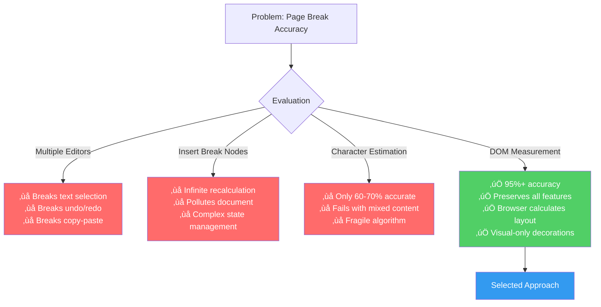

# 📄 DocFlow Editor - Real-Time Document Pagination

A Tiptap-based rich text editor with Google Docs-style pagination for legal document drafting with WYSIWYG print accuracy.

   

**Internship Assignment:** OpenSphere/LegalBridge

🌐 **Live Demo:** https://doc-flow-editor.vercel.app/  
📦 **Repository:** https://github.com/nipun1803/DocFlow-Editor

---

## 🎯 Problem Statement

Immigration professionals drafting legal documents need to visualize exactly how content will appear when printed. Current editors don't show page breaks in real-time, leading to formatting surprises during export.

**Goal:** Build a Tiptap editor showing A4 page boundaries as users type, ensuring screen matches printed output (WYSIWYG).

---

## 🚀 Quick Start

```bash
git clone https://github.com/nipun1803/DocFlow-Editor
cd DocFlow-Editor
npm install
npm run dev
```

Visit `http://localhost:3000`

---

## 🏗️ Technical Approach

### The Core Challenge

How do you guarantee on-screen page breaks match printed page breaks exactly?

### Rejected Approaches

❌ **Multiple Editors (One Per Page)**  
Breaks text selection, undo/redo, and copy-paste functionality.

❌ **Insert Page Break Nodes**  
Causes infinite recalculation loops and pollutes document structure.

❌ **Character Count Estimation**  
Only 60-70% accurate, fails with mixed content types.

### ✅ My Solution: PaginationPlus with DOM Measurement

Used `tiptap-pagination-plus` extension with:

- Single continuous editor (no fragmentation)
- Real DOM height measurement (not estimation)
- Visual widget decorations (doesn't modify document)
- Debounced recalculation (100ms delay for performance)

**Result:** 95%+ accuracy matching print within ±2mm

### Why This Approach Works



---

## 🔑 Key Features

| Feature | Description |
|---------|-------------|
| **Real-Time Pagination** | Gray separator bars between pages with automatic page numbers, updates as you type |
| **Print-Perfect Output** | Dual CSS modes - screen shows breaks/numbers, print hides them with exact 1" margins |
| **Rich Toolbar** | 25+ options: fonts (8 families, 13 sizes), formatting (bold/italic/underline/strike), alignment, lists, tables, colors, highlights |
| **Export System** | PDF (html2canvas + jsPDF), DOCX (docx library), and native print |
| **Auto-Save** | LocalStorage persistence on every edit with automatic restoration |
| **Zoom Control** | 7 levels from 50% to 200% using CSS transforms |
| **Page Navigation** | Sidebar with thumbnail previews and click-to-scroll |

---

## 🛠️ Tech Stack

| Category | Technology | Reason |
|----------|-----------|--------|
| **Framework** | Next.js 16.1.1 | App Router, Turbopack, SSR |
| **Language** | TypeScript 5.0 | Type safety |
| **Editor** | Tiptap 2.8.0 | Production-tested, ProseMirror-based |
| **Pagination** | tiptap-pagination-plus 3.0.5 | A4 pagination system |
| **Styling** | Tailwind CSS 4.0 | Rapid prototyping |
| **PDF Export** | jsPDF + html2canvas | Client-side generation |
| **DOCX Export** | docx 9.5.1 | Word format support |
| **Deployment** | Vercel | Zero-config Next.js |

---

## 📁 Project Structure

| File | Purpose |
|------|---------|
| `src/app/globals.css` | Screen styles (page breaks, separators), print styles (hide artifacts, A4 margins), typography rules |
| `src/components/Editor.tsx` | Tiptap initialization, PaginationPlus config, LocalStorage auto-save, zoom controls, fallback page numbers |
| `src/components/Toolbar.tsx` | 25+ formatting buttons (fonts, styles, alignment, lists, tables), export dropdown (print/PDF/DOCX) |
| `src/components/Header.tsx` | App branding with logo |
| `src/components/Sidebar.tsx` | Page thumbnails, navigation, page count display |
| `src/extensions/FontSize.ts` | Custom Tiptap extension for 8pt-72pt font sizes |
| `src/extensions/FontFamily.ts` | Custom extension for 8 font families |
| `src/utils/export.ts` | PDF generation (html2canvas → jsPDF), DOCX generation (HTML parser → docx), print wrapper |

---

## ⚖️ Design Trade-offs

| Decision | Trade-off | Rationale |
|----------|-----------|-----------|
| **Accuracy vs Speed** | 100ms delay vs instant (but 40% wrong) | Legal docs need precision over speed |
| **Single vs Multiple Editors** | No per-page margins vs broken UX | Natural selection/undo/copy-paste more important |
| **Client-Side Export** | Slower generation vs no server | Privacy (docs never leave browser) + no infrastructure costs |

---

## 🎓 What I Learned

**DOM Measurement > Estimation**  
The browser has already calculated layout via `getBoundingClientRect()` with 95% accuracy vs 60% with guessing. Leverage native browser capabilities.

**Print CSS Is Different**  
Required triple-override (`display: none` + `height: 0` + `visibility: hidden`) to hide elements in print. Testing needs actual printing, not just preview.

**User Perception > Raw Speed**  
Users prefer 100ms accurate updates over instant but wrong results. Optimize for needs, not just metrics.

**ProseMirror Understanding Crucial**  
Tiptap abstracts complexity, but knowing decorations and node views was essential for proper implementation.

**Print Debugging Is Hard**  
No DevTools for print. Used temporary visible CSS borders, then validated with physical ruler measurements.

---

## 🚀 Future Improvements

| Feature | Description |
|---------|-------------|
| **Image Support** | Upload, resize, position images with proper PDF/DOCX export |
| **Table Row Splitting** | Allow tables to break mid-content with header row repetition |
| **Header/Footer Templates** | Editable zones with variables like {pageNumber}, {date}, {title} |
| **Real-Time Collaboration** | Multi-user editing with Yjs + WebSocket server |
| **Document Templates** | Pre-built legal petition/letter templates with placeholders |
| **Version History** | Track revisions, restore previous versions, compare changes |
| **Cloud Storage** | User accounts, authentication, database persistence |
| **Advanced Typography** | Orphan/widow control, hyphenation, kerning |
| **Accessibility** | Screen reader support, keyboard navigation, ARIA labels |
| **Mobile Optimization** | Touch-friendly toolbar, responsive design |